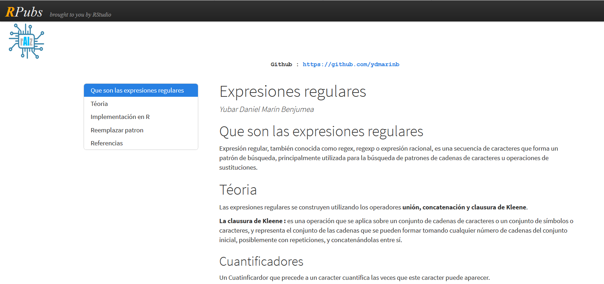
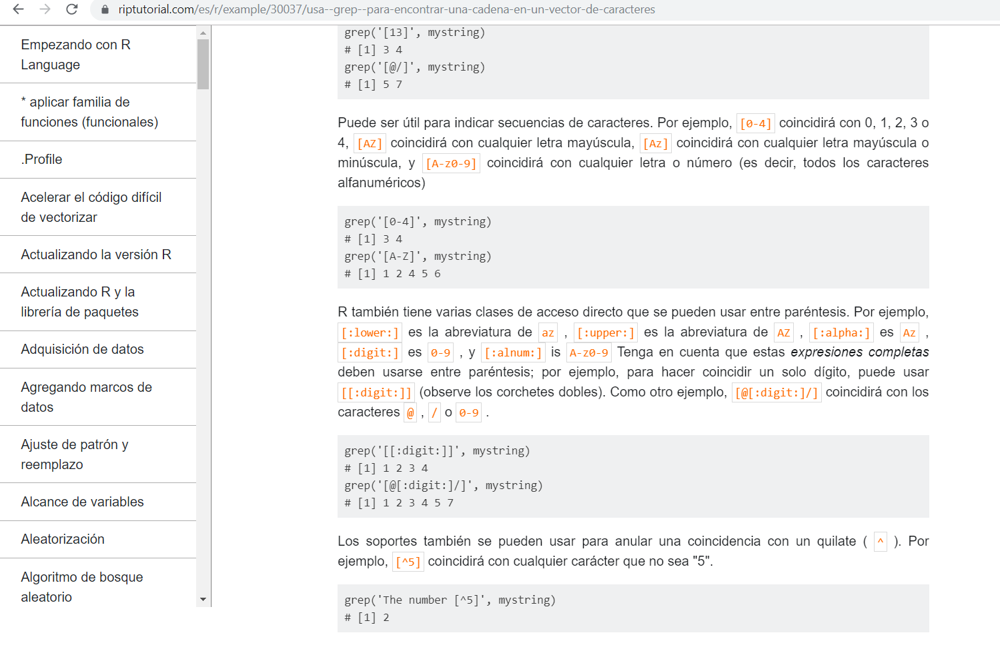
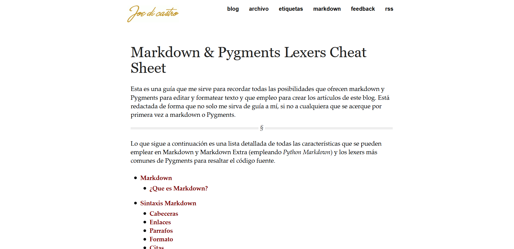
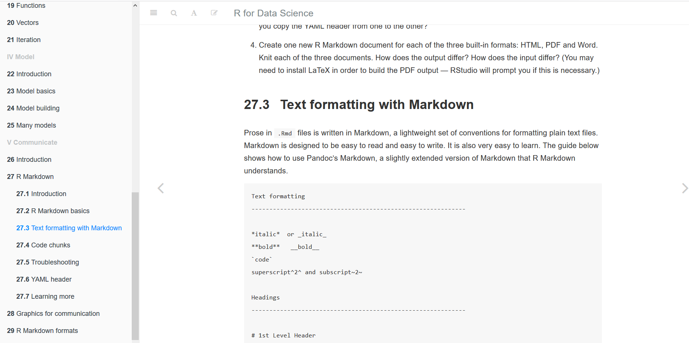

<style>
body{
"text-align: justify}
</style>


```{r setup, include=FALSE}
knitr::opts_chunk$set(echo = TRUE)
```

## Expresiones Regulares (regex) {.tabset}


Las expresiones regulares (regex, regexp o expresiones racionales), son una secuencia de distintos caracteres. Se los utiliza para realizar búsquedas, las cuales, coincidan con los criterios o patrones de una entrada o de una cadenas de texto. Las operaciones en las que más se utilizan las expresiones son: union, concatenar y clauras de Kleene. 

Los caracteres usados sueles ser similares para todos los lenguajes de programación con pequeñas diferencias: Rstudio, Java, Python, etc.

Las expresiones regulares (regex, regexp o expresiones racionales), son una secuencia de distintos caracteres. Se los utiliza para realizar búsquedas, las cuales, coincidan con los criterios o patrones de una entrada o de una cadenas de texto. Las operaciones en las que más se utilizan las expresiones son: union, concatenar y clauras de Kleene.

Los caracteres usados sueles ser similares para todos los lenguajes de programación con pequeñas diferencias: Rstudio, Java, Python, etc.


Caracteres | Comportamiento                             |      Función
---------- | ------------------------------------------ | -------------------
?          | Precedente una o ninguna vez               | Crear expresión
.          | Precedente ninguna o más veces             | Crear expresión
+          | Precedente una o mas veces                 | Crear expresión
\|         | Busca un elemento u otro (or)              | Crear expresión
^          | Indica el inicio del patrón                | Crear expresión
$          | Indica el final del patrón                 | Crear expresión
.          | Cualquier caracter                         | Crear expresión
\\         | No interpreta un carácter especial         | Crear expresión
()         | Captura el contenido                       | Agrupar expresión
[]         | Captura los caracteres dentro              | Agrupar expresión
{}         | Número de repeticiones mínimo y máximo     | Agrupar expresión


### RPubs

**Rpubs** es un documento (seguramente creado en Markdown), donde realiza un análisis general en el uso de las expresiones irregulares. El documento se encuentra dividido por 6 distintos tipos de clasificaciones para las expresiones regulares:

* Cuantificadores.
* Alternación.
* Agrupación.
* Barra invertida.
* El signo de admiración.
* Metacaracteres especiales.


**RPubs** define las expresiones irregulares de forma muy concisa y clara. Logra explicar, según su clasificación cada caracter, sin embargo, carece de ejercicios o ejemplos que logren explicar el uso de los mismos y la estructura que se debe utilizar. El análsis presentado es teórico pero muy resumido. Se encuentra enfocado para personas que tengan ya un expertise en el uso de los operadores  de union, concatenación y clausura de Kleene y de las expresiones.

[LINK-RPubs](http://rpubs.com/ydmarinb/429756)

<center>

</center>

### Riptutorial

_**Riptutorial**_, por otro lado, nos habla sobre las expresiones irregulares con menos estructura y enfocado. Este documento (seguramente un Markdown), tiene un lenguaje menos académico en comparación de **RPubs**. A pesar que el análisis de las expresiones regulares solo sirve para la función **grep**(función para encontrar una vector de caractéres), sin embargo, los ejemplos son muy claros y prácticos. Incluye cuadros de código fáciles de entender.

Este artículo esa enfocado para personas que no sepan mucho sobre el uso de la funciones de transformación de vectores.

[LINK-Riptutorial](https://riptutorial.com/es/r/example/30037/usa--grep--para-encontrar-una-cadena-en-un-vector-de-caracteres)

<center>

<center>

## Markdown {.tabset}

Es un lenguaje creado por John Gruber para edición de texto o como tambien se lo conoce como marcado ligero. Markdown ha sido utilizado por varios lenguajes de programación PHP, Python, Ruby, Rstudio, Java y Common Lisp.


### joedicastro

 

Es un blog que explica a pocos rasgos el uso de Markdown. Es un texto muy facil de entender, da los lineamientos principales para comenzar con el uso de Markdown. Por otro lado, los comando usados son para dar formato al texto.

[LINK-Joedicastro](https://joedicastro.com/pages/markdown.html)





### R for Data Science

 

**R for Data Science** Es un documento, que detalla muchas funcionalidades de Markdown aplicado en Rstudio, incluye secciones de diversos temas. **R for Data Science** , es muy funcional, ya que, tiene muchos ejemplos de código. Tiene un lenguaje más académico, sine mbargo, sirve para tanto las personas que estan iniciando en Markdown o ya tienen experiencia.

[LINK-Rfordatascience](https://r4ds.had.co.nz/r-markdown.html#r-markdown)





## Impuesto al valor agregado (IVA) en el mundo {.tabset .tabset-fade}

El **Impuesto al valor agregado** o **IVA**, es un impuesto que los países graban al consumo doméstico final de productos y servicios. Se lo presenta como un incremento porcentual al valor final del producto o servicio. Este impuesto es muy importante para el desarrollo del país, ya que, si logras manejar la recaudación, gestionarás una mejora significativa tanto para el gobierno, las empresas y los ciudadanos.

La gran mayoria de los países registran este impuesto, **datos macro**, es una base de datos que registra los valores históricos del porcentaje gravado por cada país (2008 - 2018). Cabe recalcar que ciertos países analizados tiene IVA 0% o no tiene datos.


### Tabla y mapa de IVA

```{r tabla, echo=FALSE, message=FALSE, warning=FALSE}

library(rvest)
library(reshape2)
library(DT)
library(highcharter)
library(dplyr)
library(tidyverse)
library(plyr)
library(RColorBrewer)
library(plotly)

##################################
#####   tabla IVA          #######
##################################

##Carga de las tablas de los 11 diferentes años: 

year <- c("2008", "2009", "2010", "2011", "2012", "2013", "2014", "2015", "2016", "2017", "2018")

#loop para poder extraer el URL de cada año: 

tmp <- list()
j=1

for (i in year) {
  url <- paste("https://datosmacro.expansion.com/impuestos/iva?anio",i, sep = "=")
  tmp[j]= url
  j=j+1
}


#loop para poder extraer las tablas de cada año: 

tmp2 <- data.frame()
tmp3 <- list()

for (i in 1:length(tmp)){
  x <- paste(tmp[i])
  x <- read_html(x, encoding = "UTF-8") %>%
    html_nodes("table") 
  x <- html_table(x[[1]], fill = T)
  names(x) <- NULL
  tmp2 = x
  tmp2$anio <- i
  tmp3[[i]]= tmp2
}

#union de cada tabla en un data frame:

iva <- rbind(tmp3[[1]], tmp3[[2]], tmp3[[3]], tmp3[[4]], tmp3[[5]], 
      tmp3[[6]], tmp3[[7]], tmp3[[8]], tmp3[[9]], tmp3[[10]], tmp3[[11]])

#limpieza de tabla: 

iva[, 6] <- NULL

colnames(iva) <- c("Paises", "Fecha", "IVA reducido", "IVA general", "IVA", "Var.", "anio")
iva$Paises <- gsub(" $", "", gsub("\\[[+]]", "", iva[,1]))
iva$Fecha <- as.Date(iva$Fecha, "%d/%m/%Y")
iva.tabla <- iva[, c(1:2, 5, 7)]
iva$IVA <- gsub(",", ".",gsub("%$", "", iva[,5]))%>%
  as.numeric() %>%
  round( digits = 0)
iva <- iva[, c(1:2, 5, 7)]

#diccionario de años:

anio <- c(1:11)
dic <- cbind(year, anio)

#union diccionario vs tabla de IVA: 

iva <- merge(iva, dic, by= "anio", all = T)
iva <- iva[,c(2, 4:5)]

iva.media <- ddply(iva, .(Paises), summarize, media = mean(IVA))
iva.media$media <- round(iva.media$media, digits = 0)


#cambio formato de tabla IVA: 

iva.largo <- dcast(iva, Paises ~ year, value.var = "IVA")

```


Como podemos observar, tenemos un mapa que reflejan el valor medio de los años 2008 al 2018 del IVA. Los colores de los gráficos, nos muestra el IVA en los diferentes países, que varian desde 0% a 30%.

Podemos observar que las regiones que tienen valores más altos son Europa y America del Sur.

```{r mapa, echo=FALSE, message=FALSE, warning=FALSE}
#####################################
##### tabla dinámica de datos #######
#####################################

iva.tabla <- merge(iva.tabla, dic, by= "anio", all = T)
iva.tabla <- iva.tabla[,c(2, 4:5)]

iva.tabla <- dcast(iva.tabla, Paises ~ year, value.var = "IVA")

datatable(iva.tabla, rownames = FALSE, filter="top", options = list(pageLength = 10, scrollX=T))


#####################################
#####      mapa gráfico       #######
#####################################

#carga tabla de validación de paises con formato ISO: 

pais <- data.frame(read.csv("pais.csv", sep= ";", encoding = "UTF-8", header = T))

#union de base IVA con tabla de paises:

iva.media<-merge(iva.media, pais, by.x = "Paises", by.y = "pais", all.x=T )
iva.media<-iva.media[, 1:3]

mapdata <- get_data_from_map(download_map_data("custom/world-robinson"))

map <- merge(iva.media, mapdata, by.x = "alfa.3", by.y = "iso-a3", all.x=T )

map <- as_tibble(map)

#mapa gráfico:

mapas <- map %>%
  select(pais =`hc-a2`) %>% 
  mutate(X=map$media)


hcmap("custom/world-robinson", data = mapas, value = "X",
      joinBy = c("hc-a2", "pais"), name = "IVA",
      dataLabels = list(enabled = TRUE, format = '{point.name}'),
      borderColor = "#FAFAFA", borderWidth = 0.5,
      tooltip = list(valueDecimals = 0, valueSuffix = "%")) %>%
  hc_mapNavigation(enabled = TRUE) %>%
  hc_colorAxis(minColor = "#CCCCCC", maxColor = "#009999")%>%
  hc_title(text = "Mapa dinámico IVA Países (media de 2008 - 2018)",
           align = "center", style = list(color = "#000000", fontWeight = "bold"))

```


### IVA por región

Este gráfico nos muestra como el IVA en promedio ha evolucionado a lo largo del tiempo, si existió una variabilidad o talvez una crisis que incentivara a este cambio de decisión.

Al evaluar a lo largo del tiempo el IVA de cada continente podemos sacar varias conclusiones:


***África:** Tiende a estar entre un valor de 14% desde el año 2016 aumentaron 1%, este es el continente con menos variabilidad.
***América:** Es uno de los más flutuantes, pero se mantienen fluctuando entre 15% al 13%.
***Asia:** Existe un cambio significativo de estar entre un 12% al 9%.
***Europa:** Es el continente con un IVA más alto, claramente vemos que del 2008 al 2009 existió un aumento de 1% en promedio y del 2012 al 2013 tambien, podriamos deducir que una de las variabilidad es por la crisis que se presento en Europa.
***Oceanía:** Es el continente con menor valor de IVA.

```{r grafico, echo=FALSE, message=FALSE, warning=FALSE}
#####################################
#####      continentes        #######
#####################################

continentes <- "https://github.com/lukes/ISO-3166-Countries-with-Regional-Codes/blob/master/all/all.csv"
continentes <- read_html(continentes)
continentes <- html_nodes(continentes, "table")

continentes <- html_table(continentes[[1]], fill = TRUE, header = T)
continentes <-continentes[, c(4, 7:8)]

iva.largo_1 <- merge(iva.largo, pais, by.x = "Paises", by.y = "pais", all.x=T )
iva.largo_1 <- iva.largo_1[, 1:13]

iva.largo_2 <- melt(iva.largo_1, id.vars = c("Paises", "alfa.3"))

iva.continentes <- merge(iva.largo_2, continentes, by.x = "alfa.3", by.y = "alpha-3", all.x=T )
iva.continentes <- iva.continentes[, 2:6]
colnames(iva.continentes)<-c("Paises", "anio", "valor", "region", "subregion")

#Plot de los países a lo largo del tiempo por región 

col <- colours()
col <- sample(col,1419,replace=T) 

iva.continentes$anio <- as.factor(substr(iva.continentes$anio, 3, 4))

#mapa por continente a lo largo del tiempo
media.continente <- ddply(iva.continentes, .(region, anio), summarize, media = round(mean(valor, na.rm = T, digits = 0)))

ggplot(data = media.continente) +
  geom_bar(mapping = aes(x = anio, y = media, fill=region),stat = "identity", position=position_dodge())+
  facet_wrap( ~ region)+theme(panel.background = element_blank(),  legend.position="none")+
  labs(x = "Años", y = "IVA")

```

&nbsp;
<hr />
<p style="text-align: center;">A work by <a href="https://github.com/Krojasvelez92">Karla Rojas V.</a></p>
<p style="text-align: center;"><span style="color: #638;"><em>karlarojasvelez92@gmail.com</em></span></p>

<!-- Add icon library -->
<link rel="stylesheet" href="https://cdnjs.cloudflare.com/ajax/libs/font-awesome/4.7.0/css/font-awesome.min.css">

<!-- Add font awesome icons -->
<p style="text-align: center;">
    <a href="https://www.linkedin.com/in/karla-e-rojas-v%C3%A9lez-business-analyst-and-big-data-0b786199/" class="fa fa-linkedin"></a>
    <a href="https://github.com/Krojasvelez92" class="fa fa-github"></a>
</p>

&nbsp;
